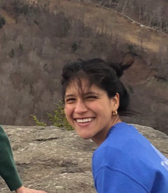
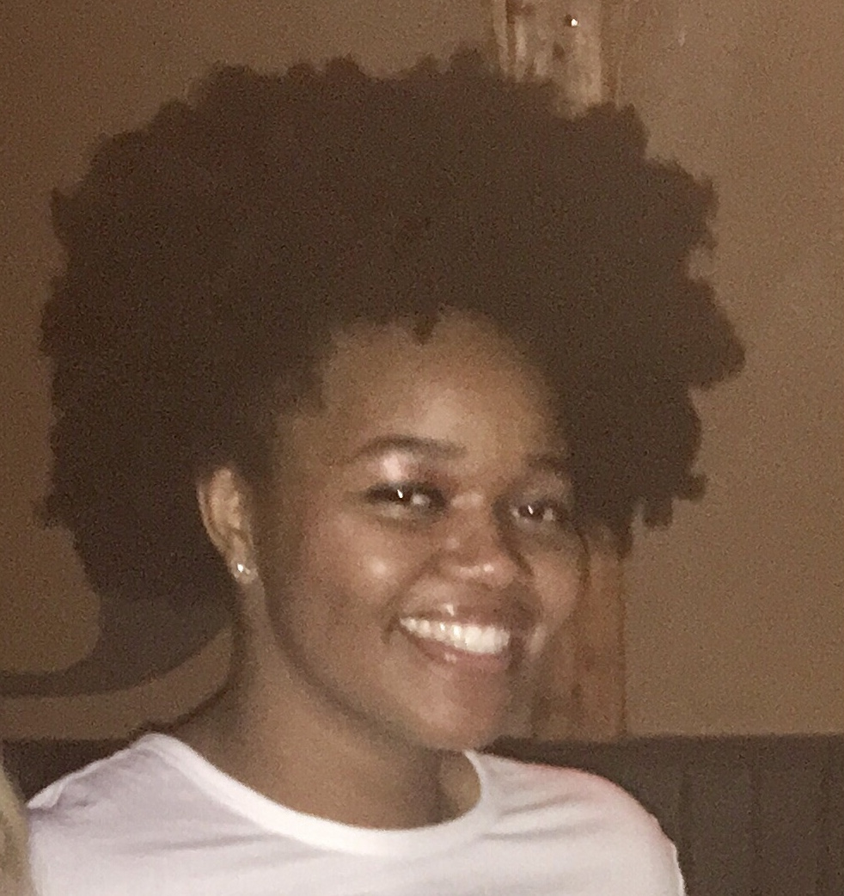

## Student Bios

We are a group of 2nd year MPH students at Columbia University, proud to present you the skills we've developed over the semester with [p8105!](https://p8105.com)

<h2>Maria, the plotly Queen </h2>

**Maria Guzman**: Maria is an Epidemiology student with a focus on Applied Biostatistics. Born in Ecuador and raised in Connecticut, Maria is obsessed with pugs, especially her dog Frankie. Maria cares about using data to assess and tailor health programs with the goal of improving access to care. In her free time she enjoys knitting and thrifting. 

<h2>Ronaé, the ggplot Goddess </h2>

**Ronaé McLin**: Ronaé is a Population and Family Health student with a focus on Research Methods. She doesn’t have a hometown, but lukewarmly claims Ohio.  Ronaé is passionate about ensuring that minoritized groups have equal access to and treatment within healthcare.  In her free time she enjoys technical baking and making lists.  

<h2>Adam, the tidy King </h2>

**Adam Whalen**: Adam is an Epidemiology student with a focus on Applied Biostatistics.  Orginially from California, Adam loves to talk about single payer healthcare. He is interested in studying the social and spatial distribution of factors that impact health outcomes, specifically for civilian interactions with the police. In his free time he enjoys playing Settlers of Catan and drinking craft beer. 

## Fun

Check out our playlist, features music we like to code to 

<iframe src="https://open.spotify.com/embed/playlist/4jaJwJZELmM2jDbkluVzUX" width="300" height="380" frameborder="0" allowtransparency="true" allow="encrypted-media"></iframe>

<html>
<head>
<meta name="viewport" content="width=device-width, initial-scale=1">

</head>
<body>

</body>
</html>