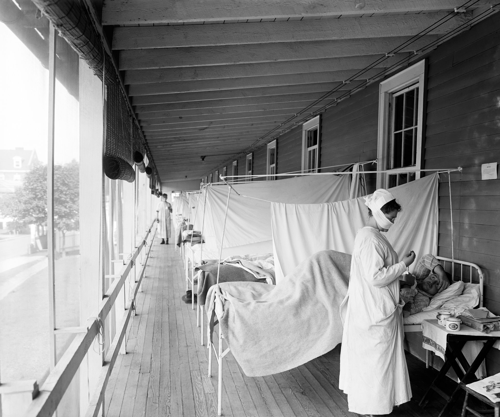

[**The influenza ward at the Walter Reed Hospital in Washington, circa 1918.**](https://www.nytimes.com/2020/03/20/world/europe/coronavirus-aids-spanish-flu-ebola-epidemics.html)

Below are some additional resources at your disposable regarding vaccines!

<ul><li> [Communication resources](https://www.cdc.gov/flu/resource-center/index.htm)
<li> [Vaccine finder](https://vaccinefinder.org/find-vaccine)
<li> For persons with [vulnerable health statuses](https://www.cdc.gov/flu/highrisk/index.htm)
<li> Where to obtain [low or no cost immunizations in NYC](	https://www1.nyc.gov/site/doh/services/immunization-clinics.page) regardless of immigration status
<li> [Reading to combat Anti-Vaxxers](https://www.theatlantic.com/health/archive/2020/10/how-change-mind-anti-vaxxer/616722/)
<li> [Poignant images of prior epidemics](https://www.nytimes.com/2020/03/20/world/europe/coronavirus-aids-spanish-flu-ebola-epidemics.html)

